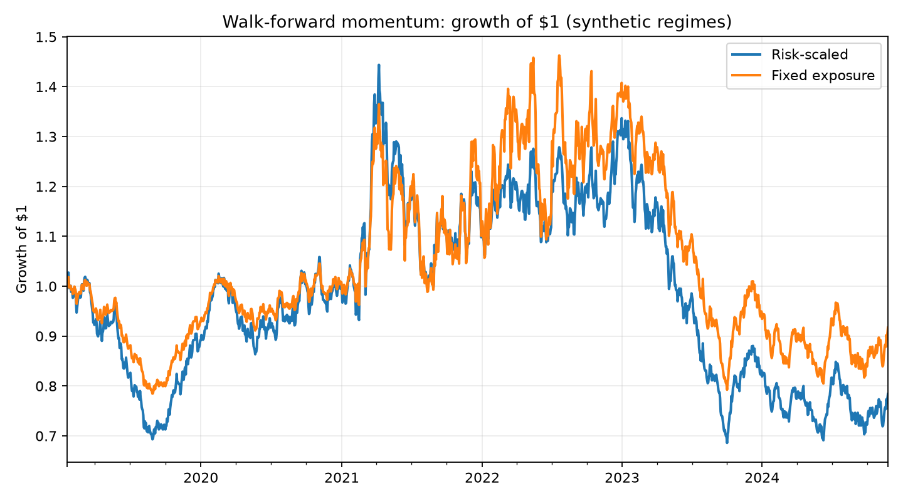

# Walk-Forward Quant Lab

A compact, reproducible research project for testing whether a simple
volatility forecast can improve the risk profile of a momentum strategy.
The pipeline is designed around the details that matter in real quantitative
work: time-series leakage, walk-forward refitting, transaction costs,
turnover, and comparison with a transparent baseline.

> Educational research only. This is not investment advice and is not a live
> trading system.

## Research question

Can a one-step-ahead variance forecast be used to scale a 20-day momentum
signal toward a target volatility while reducing drawdowns and avoiding
look-ahead bias?

The model predicts next-day log squared returns from information available at
the current close. The forecast controls position size; it does **not** decide
the direction of the trade. Direction comes from a deliberately simple
20-day momentum signal, which makes the contribution of risk scaling easier
to interpret.

## What this demonstrates

- Leakage-aware feature and target alignment
- Expanding or rolling walk-forward model estimation
- Volatility targeting with an explicit leverage cap
- Turnover-based transaction costs
- Baseline comparison and standard risk metrics
- Reproducible synthetic regimes plus an optional public-data loader
- Automated tests for the most failure-prone alignment logic

## Method

At the end of day `t`, the pipeline computes lagged returns, momentum,
realized volatility, downside volatility, and range-based features. A ridge
regression is trained only on samples whose next-day outcome is already known
at `t`. It predicts `log(r[t+1]^2 + eps)`, which is transformed into an
annualized volatility forecast.

The position held from `t` to `t+1` is:

```text
direction[t] = sign(momentum_20[t])
scale[t]     = clip(target_vol / predicted_vol[t], 0, leverage_cap)
position[t]  = direction[t] * scale[t]
```

Strategy returns include a cost proportional to absolute position changes.
The baseline uses the same directional signal at fixed one-times exposure, so
the comparison isolates the risk-sizing layer.

## Quick start

```bash
python -m venv .venv
source .venv/bin/activate
pip install -e ".[dev]"
walkforward-quant --source synthetic --output artifacts
pytest
```

To use daily public market data from Stooq instead:

```bash
walkforward-quant --source stooq --symbol spy.us --output artifacts
```

Stooq availability and symbol conventions can change. The synthetic mode is
the default so the complete experiment remains deterministic and testable
without network access.

## Example output

The committed chart below is generated from the deterministic synthetic
three-regime market (`seed=7`). It is an illustration of the workflow, not a
claim about live performance.



The command also writes `artifacts/metrics.json` with CAGR, annualized
volatility, Sharpe ratio, maximum drawdown, and turnover for both strategies.

### Result from the reproducible example

The initial hypothesis is **not supported** by this synthetic experiment. Risk
scaling reduced annualized volatility only modestly (24.3% versus 25.3%), while
its higher turnover (66.8 versus 51.9) and trading costs produced a worse
maximum drawdown (-52.5% versus -45.8%) and Sharpe ratio (-0.04 versus 0.07).

That negative result is useful rather than something to hide. It suggests the
next research iteration should test forecast smoothing, a position-change
deadband, and nested selection of the target-volatility parameter. Those
extensions should be evaluated on a separate walk-forward period rather than
tuned against this committed example.

## Repository layout

```text
src/walkforward_quant_lab/
  data.py       # deterministic regimes and optional Stooq download
  features.py   # leakage-aware predictors and next-day target
  model.py      # walk-forward ridge forecasts
  backtest.py   # positions, costs, metrics, and charting
  cli.py        # reproducible command-line experiment
tests/
  test_pipeline.py
.github/workflows/
  test.yml
artifacts/
  equity_curve.png
  metrics.json
```

## Design choices and limitations

- Squared daily return is a noisy volatility proxy; realized multi-day or
  intraday estimators would be natural extensions.
- Hyperparameters are intentionally fixed. A production study should nest
  model selection inside the walk-forward loop.
- The example is single-asset and ignores market impact, financing, taxes,
  borrow constraints, and execution uncertainty.
- Synthetic regimes help test behavior but cannot establish real-world alpha.

These limitations are part of the project: a credible research artifact
should make its assumptions and failure modes easy to inspect.

## Data source

Optional real-market observations are downloaded on demand from
[Stooq](https://stooq.com/q/d/l/) and are not committed to this repository.
